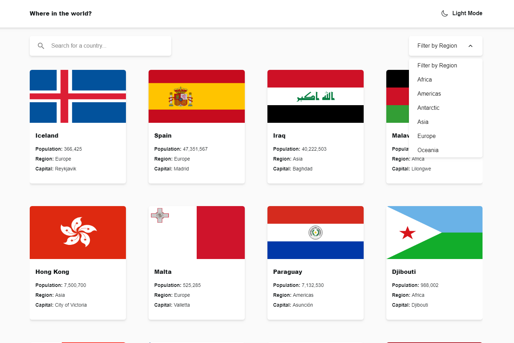

# Frontend Mentor - REST Countries API with color theme switcher solution

This is a solution to the [REST Countries API with color theme switcher challenge on Frontend Mentor](https://www.frontendmentor.io/challenges/rest-countries-api-with-color-theme-switcher-5cacc469fec04111f7b848ca). Frontend Mentor challenges help you improve your coding skills by building realistic projects.

## Table of contents

- [Overview](#overview)
  - [The challenge](#the-challenge)
  - [Screenshot](#screenshot)
  - [Links](#links)
- [My process](#my-process)
  - [Built with](#built-with)
  - [What I learned](#what-i-learned)
  - [Continued development](#continued-development)
- [Author](#author)

## Overview

### The challenge

Users should be able to:

- See all countries from the API on the homepage
- Search for a country using an `input` field
- Filter countries by region
- Click on a country to see more detailed information on a separate page
- Click through to the border countries on the detail page
- Toggle the color scheme between light and dark mode *(optional)*

### Screenshot



### Links

- Solution URL: [REST Countries API](https://github.com/wuzgood98/rest-countries-api)
- Live Site URL: [REST Countries API](https://rest-countries-api98.netlify.app/)

## My process

### Built with

- Semantic HTML5 markup
- CSS custom properties
- Flexbox
- Mobile-first workflow
- [React](https://reactjs.org/) - JS library
- [Tailwindcss](https://tailwindcss.com/) - For styles

### What I learned

This actually my first project working with react router dom. Started learning react not long ago and it was a fun experience. I learned how to use the "Link" component to navigate to other pages. And also learned to use the 'useParams' hook to get the route name for data filtering and API calls.

```js
const { paramName } = useParams();

fetch(`https://www.example-api.com/name/${paramName}`)
  .then((result) => result.data)
  .catch((error) => console.log(error))
```

### Continued development

Continue developing with react router dom. I still have not had a complete grasp on the library. I am going to be developing multi-page sites to help me get a full grasp on the library.

## Author

- Frontend Mentor - [@wuzgood98](https://www.frontendmentor.io/profile/wuzgood98)
- Twitter - [@wuz_goood](https://www.twitter.com/wuz_goood)
